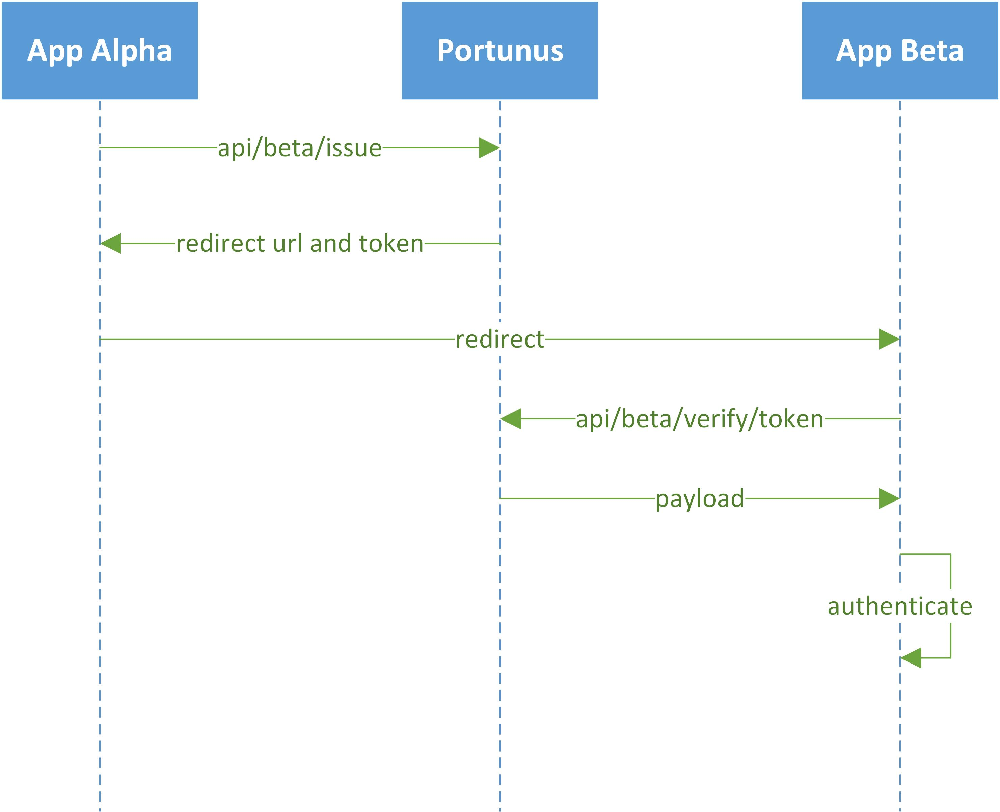

# Portunus
Portunus - the god of keys - a small and simple single sign-on service, that issues and verifies access tokens.

## Prerequisites
Uses .Net Core 2.1.

For internal use only. Assumes that network is secure. Assumes it is being called from a trusted source.

## Configuration

Configuration is done via appsettings.json file.

The main section of configuration is SSOSettings - it configures applications that you can log into via SSO.
Example:
```json
{
    "SSOSettings": {
    "Apps": [
      { },
      { },
      { }
    ]
  }
}
```

Each app that needs SSO has to provide following settings:
* app name - serves as a key in dictionary of apps;
* address template of a page that knows how to authenticate user by provided token. `{0}` will be replaced with token string;
* expiration time in seconds;
* public and private RSA keys in PEM format;

Example:
```json
{
  "AppName": "alpha",
  "AuthenticationUrlTemplate": "http://localhost:5001/SSO/Login/{0}",
  "ExpireInSeconds": 60,
  "TokenProviderSettings": {
    "PrivateKey": "RSA private key in PEM format",
    "PublicKey": "RSA public key in PEM format"
  }
}
```

## Use case

App Alpha wants to sign users into App Beta without additional login/password input.

* App Alpha requests a token from Portunus service specifing App Beta as a target.
* Protunus returns address of a page on App Beta that knows how to authenticate user via Portunus.
* App Alpha redirects user to received address.
* App Beta processes a request and asks Portunus to verify a token.
* Portunus performs verification and responds with payload or 401 Unauthorized.
* App Beta processes response from Protunus and authenticates/rejects user.


<p align="center">
  
</p>

## Rest Api
Portunus exposes two main endpoints - 'issue' and 'verify', plus additional 'healthcheck' endpoint, that simply returns 200 OK.
### Issue
Issues new access token for specified app with provided payload.
* **URL**

  api/:app/issue
  
* **Method**

  `POST`
  
* **URL Params**

  **Required:**

  `app=[string]`

* **Data Params**

  **Required:**
   
   `[object]`
   
* **Success Response**

  Returns url with generated token from corresponding app's configuration.

  * **Code:** 200 OK <br />
    **Content:** `http://localhost:5001/SSO/Login/{token}`
  
* **Error Response**

  * **Code:** 404 NOT FOUND <br />
    **Reason:** Requested app is not in the configuration file

  OR

  * **Code:** 400 BAD REQUEST <br />
    **Reason:** Request parameter is invalid
    
  OR

  * **Code:** 500 INTERNAL SERVER ERROR <br />
    **Reason:** Unexpected exception occured

### Verify
Verifies that access token for specified app is valid.
* **URL**

  api/:app/verify/:token
  
* **Method**

  `GET`
  
* **URL Params**

  **Required:**

  `app=[string]`

  `token=[string]`
   
* **Success Response**

  Returns payload from the token.

  * **Code:** 200 OK <br />
    **Content:** `[object]`
  
* **Error Response**

  * **Code:** 401 UNAUTHORIZED <br />
    **Reason:** Token is invalid e.g. expired, was tampered with

  OR

  * **Code:** 404 NOT FOUND <br />
    **Reason:** Requested app is not in the configuration file

  OR

  * **Code:** 400 BAD REQUEST <br />
    **Reason:** Request parameter is invalid
    
  OR

  * **Code:** 500 INTERNAL SERVER ERROR <br />
    **Reason:** Unexpected exception occured

### Healthcheck
Returns 200 OK.
* **URL**

  api/healthcheck
  
* **Method**

  `GET`
   
* **Success Response**
  * **Code:** 200 OK
  
* **Error Response**
  * **Code:** 500 INTERNAL SERVER ERROR <br />
    **Reason:** Unexpected exception occured
    
## License
This project is licensed under the MIT License - see the [LICENSE](https://github.com/wolf8196/Portunus/blob/master/LICENSE) file for details
